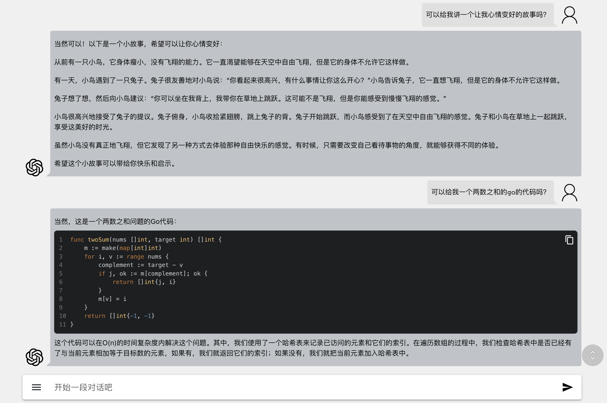
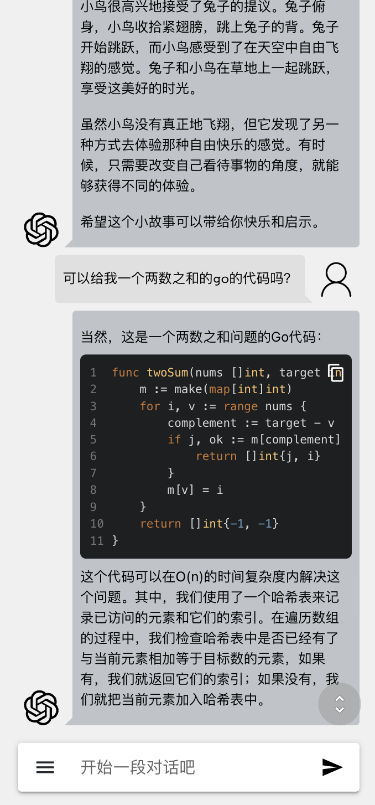

# Fastgo-Chat

支持功能：

- 会话功能
- 本地记录持久化
- 代码复制
- 代码行号
- 代码高亮
- Markdown显示
- 自定义上下文数量
- 自定义接入点
- Azure 接入点
- 自定义模型
- 自定义 Prompt
- 长文本编辑
- 响应式，跨平台支持







演示地址：https://fastgo.run/

注册码：https://fastgo.run/#/register?code=70536034-c8f0-43d4-8ab0-66b5d443c3e7

运行：

```bash
npm run dev
```

编译：

```bash
npm run build
```
